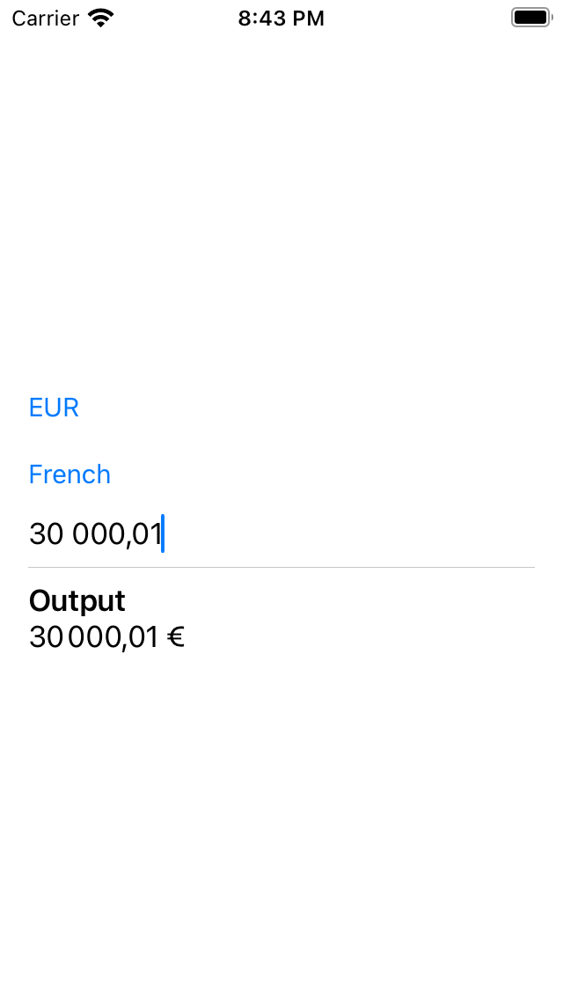

# Currency Jam

A demo app for testing out SwiftUI money inputs and formatting.

## Examples

The "amount" input is backed by a struct called [MoneyParser](./Shared/MoneyParser.swift) which handles whitespace, thousands delimiters, and decimal separators.

Check out more scenarios in the [Tests/MoneyParserTests.swift](./Tests/MoneyParserTests.swift) file.

|                     |                               |
| ------------------- | ----------------------------- |
| EUR, France         |  |
| USD, United States  |  |
| GBP, United Kingdom |  |
